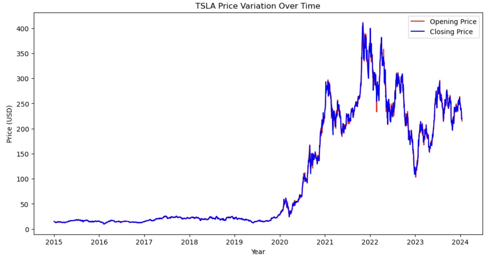
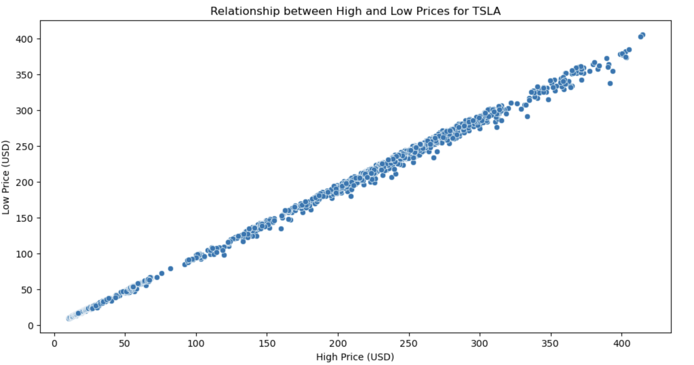
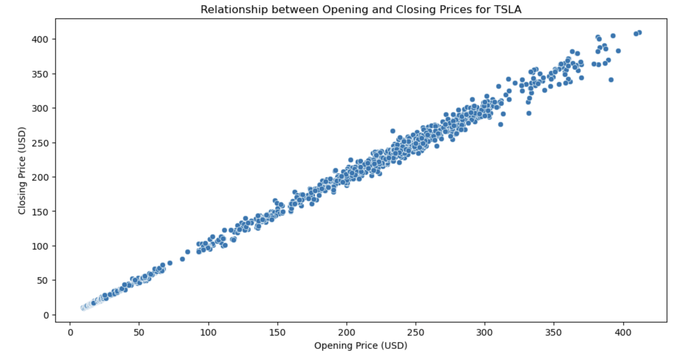
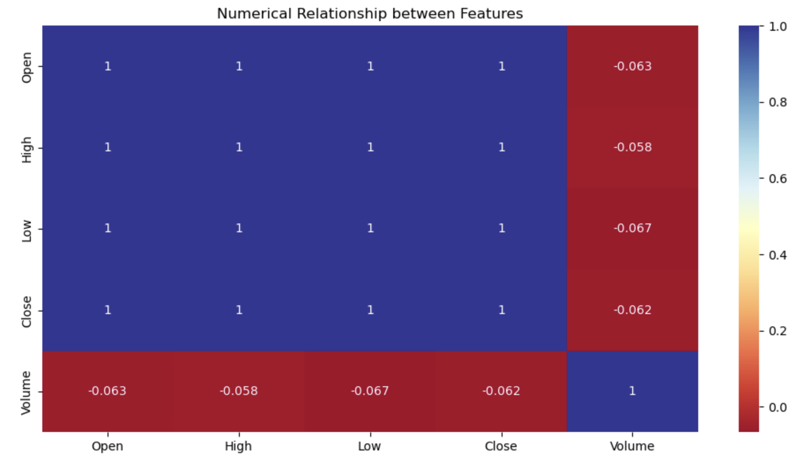
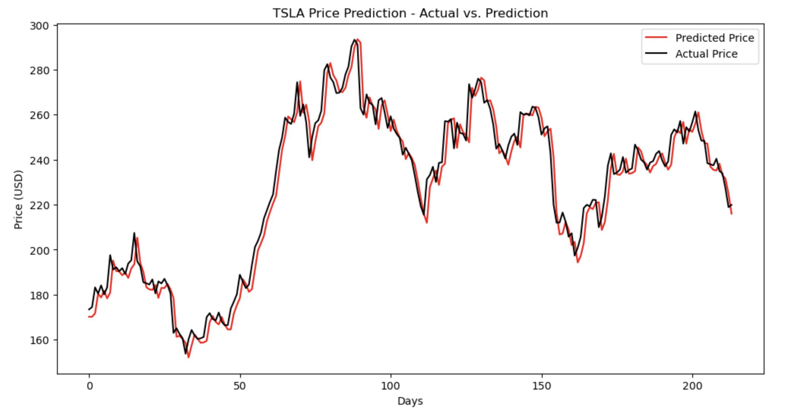

# 📈 Tesla Stock Price Prediction — LSTM (Time Series)

## 📌 Overview

Forecasting stock prices is a complex and high-impact task in financial analytics due to the inherent volatility and noise in market data. This project leverages **Long Short-Term Memory (LSTM)** neural networks, a type of recurrent neural network (RNN) well-suited for sequential data, to model and predict the closing price of Tesla stock.

The dataset comprises historical stock metrics such as ```Open```, ```High```, ```Low```, ```Close```, and ```Volume```, recorded on a daily basis. The objective is to develop a predictive model that captures the temporal dependencies in stock behaviour to forecast future closing prices.

---

## 🎯 Project Objective

Develop a deep learning model using LSTM architecture to predict Tesla’s stock **closing price** by learning from historical patterns in time series data.

---

## 🛠️ Project Workflow

| Step | Description |
|------|-------------|
| 1. Data Acquisition | Loaded daily Tesla stock data with features including ```Open```, ```High```, ```Low```, ```Close```, and ```Volume```. |
| 2. Data Preprocessing | - Normalized values using `MinMaxScaler`<br>- Generated input sequences with sliding window approach (window size = 14)<br>- Split data into training and testing sets |
| 3. Model Architecture | Built a deep LSTM model with:<br>→ Two stacked `LSTM` layers<br>→ One fully connected `Dense` layer<br>→ `Dropout` layer for regularization |
| 4. Model Training | Compiled with the `Adam` optimizer and `mean_squared_error` loss; used `EarlyStopping` to monitor validation loss and avoid overfitting. |
| 5. Prediction & Inversion | Predicted scaled values and inverse-transformed them using the scaler to obtain actual stock price predictions. |
| 6. Evaluation | Evaluated model using `MAE` and `RMSE` to quantify prediction accuracy. |
| 7. Visualization | Plotted actual vs predicted stock prices to assess temporal alignment. |

---

## 📊 Exploratory Data Analysis (EDA)

To better understand the behaviour and relationships within the stock price data, several exploratory visualizations were generated:

### 1. Open vs Close Prices Over Time
A multi-year line plot was created to visualize `Open` and `Close` price trends. This graph illustrates how the stock opened and closed each trading day over time. The overlay helps identify:

- Annual trends in stock volatility and growth.
- Market momentum and directional shifts across years.




### 2. High vs Low Price Relationship
A scatter plot comparing `High` vs `Low` prices confirms a strong linear relationship, as expected. Key insights include:

- Daily price ranges are relatively tight with few outliers.
- A nearly 1:1 trend indicates typical intraday trading stability.
- Occasional wider spreads may point to higher volatility sessions.




### 3. Open vs Close Price Relationship
This scatter plot compares `Open` and `Close` prices to assess how often the stock ends higher or lower than it starts:

- Points above the diagonal represent positive days.
- Points below the diagonal represent negative days.
- The clustering around the diagonal indicates many days with minimal change.




### 4. Correlation Matrix
A correlation heatmap was generated to identify statistical relationships between all numerical features:

- Strong positive correlation between `Open`, `High`, `Low`, and `Close` prices.
- `Volume` shows relatively weak correlation with price-based features, suggesting it behaves independently.
- The heatmap supports feature selection and can help inform future multivariate modeling.




---

## 🧠 Model Architecture Summary

| Layer Name     | Layer Type | Output Shape | Parameters |
|----------------|------------|---------------|------------|
| `lstm_8`       | LSTM       | (None, 14, 128) | 66,560     |
| `lstm_9`       | LSTM       | (None, 128)     | 131,584    |
| `dense_8`      | Dense      | (None, 64)      | 8,256      |
| `dropout_4`    | Dropout    | (None, 64)      | 0          |
| `dense_9`      | Dense      | (None, 1)       | 65         |
| **Total**      |            |                 | **206,465** |

> 📦 Total Trainable Parameters: 206,465  
> 🧊 Non-trainable Parameters: 0  

---

## 📊 Model Performance

| Metric | Value |
|--------|-------|
| Mean Absolute Error (`MAE`) | 5.4085 |
| Root Mean Squared Error (`RMSE`) | 7.2318 |

---

## 📈 Visualization — Actual vs Predicted

The model’s predictions closely align with the actual closing prices, indicating that the LSTM layers effectively captured temporal dynamics in the dataset.




---

## 💡 Key Insights

- **Temporal Modeling**: LSTM networks are highly effective for learning sequential dependencies in time-series data such as stock prices.
- **Data Preparation**: Proper normalization and sequence generation were critical for model performance.
- **Overfitting Control**: `EarlyStopping` callback based on validation loss helped reduce overfitting and preserved model generalization.

---

## 📖 Notes

- **Dataset Source**: [Tesla Stock Price Dataset – Kaggle](https://www.kaggle.com/datasets/jillanisofttech/tesla-stock-price?select=Tasla_Stock_Updated_V2.csv)
- **Libraries Used**: `TensorFlow/Keras`, `NumPy`, `Pandas`, `scikit-learn`, `Matplotlib`, `Seaborn`
- **Input Window Size**: 14 days
- **Target Variable**: `Close` price

---

## 🚀 Potential Improvements

- Explore alternative architectures such as `GRU`, `Transformer`, or hybrid CNN–LSTM models
- Deploy model as a real-time prediction app using `Streamlit` or `Flask`


